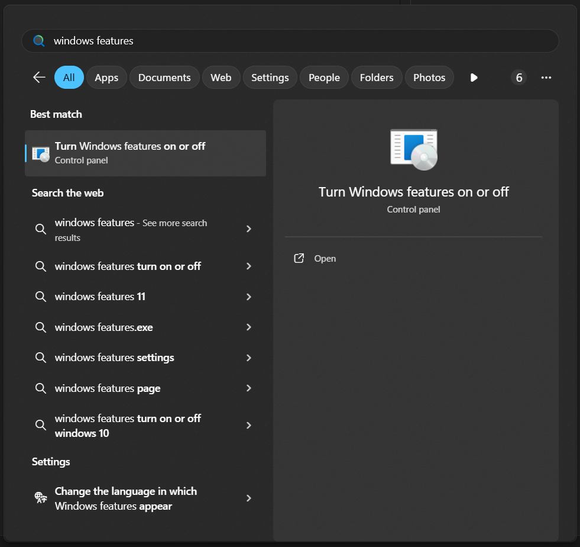
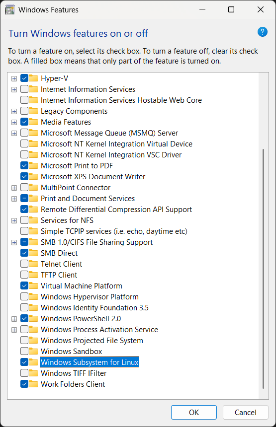
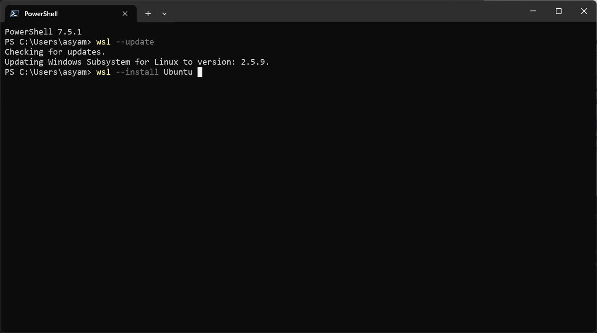
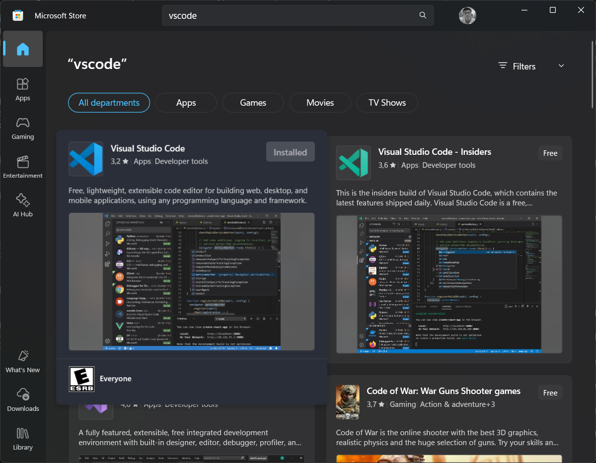
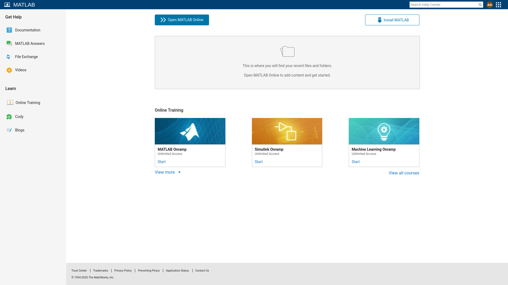
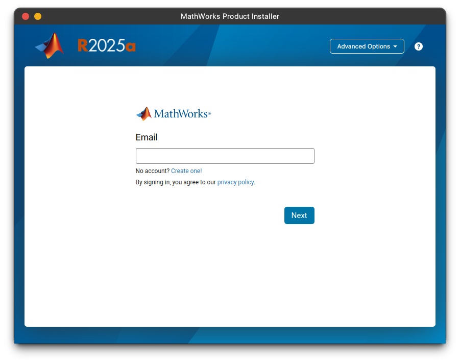
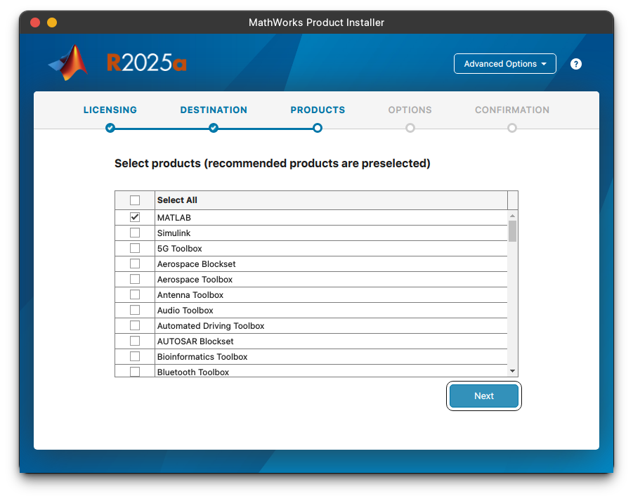
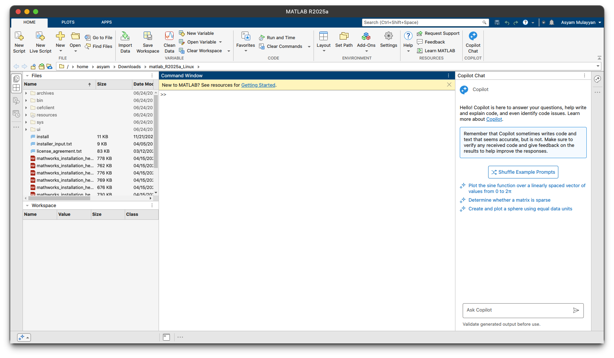

# Environment Set-Up

The first thing to do in this research is to set-up the environment. For start, we need to initiate WSL.

## Windows Subsystem for Linux (WSL)

### WSL2
--------
The default setting for any Windows system is disabled. We need to enable the feature through the setting. Search `windows features` on the search bar and open the control panel setting showed up. On the control panel, scrol down until you find `Windows Subsystem for Linux` and checked the box. Click Ok and the system will ask you to restart the system.





After enabling WSL, we need to restart the system. Do not forget the save all working progress before restarting. Then we need to open Terminal and type `wsl --update` to update the current wsl version. Wait until it finishes. The next step is to install Linux distribution or distro. There are many options to choose, but in this documentation we will install Ubuntu. We can install Ubuntu through Terminal by typing `wsl --install Ubuntu` or just searched up on the Microsoft Store to install the distro.



To start up Ubuntu, we can either type `ubuntu` on the Terminal or click it on the start menu. It then will ask us to set up the username and password. The password will be required if we use `sudo` on the Ubuntu. For start, we will update and upgrade the repository by typing this code on the Terminal:

```shell
# this line is to update the repository
sudo apt update 

# this line is to upgrade all the upgradable packages
sudo apt upgrade 
```

After that, we will install several packages that we need in this research: NetCDF, NCView, CDO, NCO, Anaconda (python), and Java. To install the packages, type this code:

```shell
# installing packages through aptitude
sudo apt install netcdf-dev ncview cdo nco default-jre

# these lines is to download and install Anaconda
curl -O https://repo.anaconda.com/archive/Anaconda3-2024.10-1-Linux-x86_64.sh
bash ~/Anaconda3-2024.10-1-Linux-x86_64.sh
```

In CDO, we can mask a region of the NetCDF file by the country using `cdo maskregion,dcw:${country}`, where `${country}` is the code of the country we want to mask. For example, if we want to mask Indonesia, we can use `cdo maskregion,dcw:ID`. The list of country codes can be found on the [DCW Website](https://www.soest.hawaii.edu/pwessel/dcw/).

To set up the environment, we need to move to the home directory by typing `cd ~` on the Terminal. Then we need to create a new directory for keeping the DCW dataset, say `DCW`, by typing `mkdir DCW`. After that, we can move to the DCW directory by typing `cd DCW`. We can download the DCW dataset from the DCW Website by typing `wget ftp://ftp.soest.hawaii.edu/dcw/dcw-gmt-2.1.2.tar.gz`. This will download the DCW dataset in a compressed file format. After that, we need to extract the file by typing `tar -xvzf dcw-gmt-2.1.2.tar.gz`. This will extract the files in the current directory. We can check the files by typing `ls` on the Terminal.

The last step is to declare the DCW directory as an environment variable, so that we can use it in the CDO command. To do this, we need to open the `.bashrc` file by typing `nano ~/.bashrc` on the Terminal. Then we need to add the following line at the end of the file:

```bash
export DCW=/home/your_username/DCW/dcw-gmt-2.1.2
```

Replace `your_username` with your actual username. After that, we need to save the file by pressing `CTRL + X`, then `Y`, and then `Enter`. Finally, we need to apply the changes by typing `source ~/.bashrc` on the Terminal.

Feel free to explore through the Ubuntu to familiarize with the system!

### WSL1
--------
If you are using WSL1, you can still follow the steps above, but we need to revert the version of the WSL2 to WSL1. Firstly, we need to disable `Hyper-V` and `Virtual Machine Platform` on the Windows Features setting, just like when we enabled WSL2. After that, we need to open PowerShell, then type `wsl --shutdown` to shut down the WSL2. Then we can type `wsl --set-default-version 1` to set the default version to WSL1. The computer will process it. Take a note that this process will take a while, so be patient. To verify that the WSL version is set to WSL1, we can type `wsl --list --verbose` on PowerShell. It will show the list of installed Linux distro and their version. If it shows `WSL 1`, then we are good to go.

Since my background is nothing related to computer science, I do not really understand the difference between WSL1 and WSL2 deeply. But as for my experience in doing the same Shell scripting in the same directory, WSL2 take 110 minutes while WSL1 only take 60 minutes. So it almost 50% faster in WSL1. If you happen to work in the Windows directory, WSL2 will take longer time than WSL1. But if you work in the Linux directory, WSL2 will be faster than WSL1. So it is up to you to choose which one is better for you.

The drawback of WSL1 is that it does not support GUI applications, so we cannot run *ncview* to visualize the NetCDF files. But we can still use *nco* and *cdo* to manipulate the NetCDF files. If you want to visualize the NetCDF files, you can switch back to WSL2 by enabling `Virtual Machine Platform` on the Windows Features setting, then type `wsl --set-version Ubuntu 2` on PowerShell. After that, you can open Ubuntu and continue the steps below.

## Visual Studio Code

This step is not necessary for this research, but Visual Studio Code (VS Code) is a powerful tool. We can integrate WSL directory on VS Code, so that we could modify and run our code seamlessly. To install it, just search `VS Code` on Microsoft Store. After that we need to initiate it by typing `code .` on Ubuntu terminal.



Just play around the VS Code to familiarize yourself with the workflow and look up any documentation on the internet!

## MatLab

MatLab is a powerful versatile tool for data analysis and visualization, although it is not free nor open-source. If your university provides a license, you can ask them on how to acquire it. In this research, our university ITS provides a education license for MatLab. One should register for an account on the [MatLab website](https://www.mathworks.com/), and do not forget to use your university email (the one that has the domain of your uni, for ITS students/lecturers it is (at)its.ac.id). After activating the account, you can download the installer on the [website](https://matlab.mathworks.com/). Fortunately, Mathworks provides support for every operating system: Windows, MacOS (Intel and Apple Silicon), and Linux.



The latest version as of June 2025 was R2025a, which has support for Copilot AI that we can use to ask help for our code. To install the software, please follow the instructions on the website accordingly. The installer will ask you to log in to your account. 



When it ask what to install, you should at least select MatLab and Mapping Toolbox. After the installation is complete, you can open MatLab and start coding! Just search up any example on the internet and familiarize yourself with the system!




