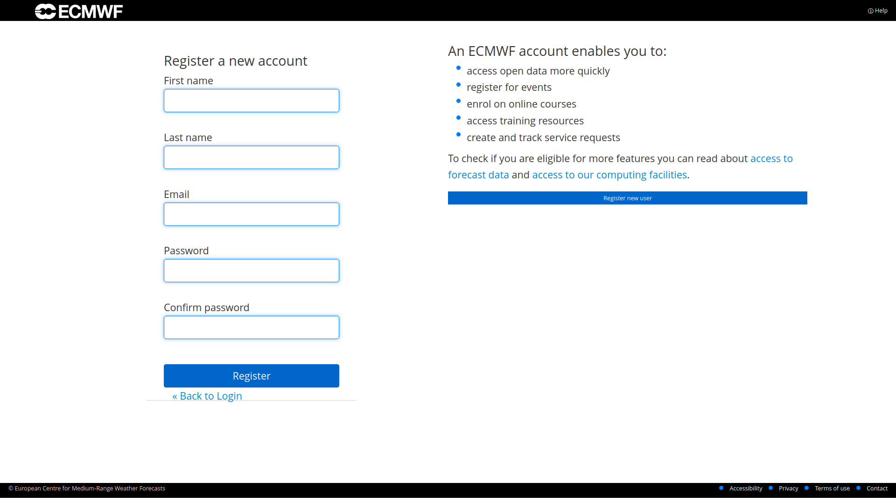
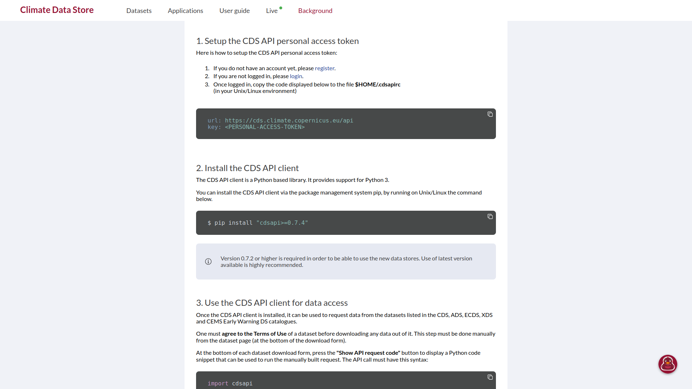

# Data Collection

After setting up the environment, we can start collecting required climate datesets. In this research we will use: (1) ERA5-Land reanalysis data, (2) SA-OBS observational data, and (3) CMIP6 EC-Earth3 climate projection data. Except for SA-OBS, all of the datasets are required to sign up for a free account on the respective website. The SA-OBS dataset is available for free without any registration. We will explain how to download each dataset below.

## SA-OBS Observational Data

SA-OBS or Southeast Asia Observational dataset is a dataset that contains daily climate data from 1981 to 2014, developed by the BMKG and KMNI. It is available for free on [SACAD website](https://sacad.bmkg.go.id/download/grid/download.php). They provide two resolutions: 0.25° and 0.5°. We will use the 0.25° resolution dataset, which is available in NetCDF format. To download the dataset, one can just click each of the links directly on the website. The dataset is divided into several variables:; (1) **rr** as daily accumulated precipitation, (2) **tg** as mean temperature, (3) **tn** as minimum temperature, and (4) **tx** as maximum temperature. The dataset is supposedly to cover the whole Southeast Asia region, but due to the incompleteness of the data, some regions are not covered for some variables at certain time periods. The precipitation has already had the unit of mm/day and the temperature has the unit of °C. Thus, we only need to change the variable names of the precipitation from `rr` to `pr` to match the other datasets. The SA-OBS dataset will be used as the reference dataset for bias-correcting the ERA5-Land reanalysis dataset and the EC-Earth3 dataset.

## ERA5-Land Reanalysis Data

ERA5-Land is managed by the ECMWF Climate Data Store (CDS) and is available for free on their climate data store [website](https://cds.climate.copernicus.eu/datasets/reanalysis-era5-land?tab=download). To download the dataset, one must first sign up for a free account on the CDS website. 

After signing up, one should set up the CDS API by following the instructions on the [CDS API documentation](https://cds.climate.copernicus.eu/api-how-to). There are two ways to download the dataset: (1) manually requesting the dataset through the CDS website, or (2) using the CDS API to download the dataset programmatically. The second method is more efficient, since each request can only download one month of data. Because we need to download the data from 1950 to 2024, it will take a long time to download the data manually. Thus, we will use the CDS API to download the dataset programmatically.

<center>*CDS page for signing up for a free account*</center>

Requesting the dataset programmatically requires us to use CDS API, which we can install using python's pip package manager. Open the terminal and type `pip install cdsapi` to install the CDS API package. After that, we need to create a file named `.cdsapirc` in our home directory. One should note that the directory is depend on their operating system. For example, on Windows, the home directory is `C:\Users\<username>`, while on Linux or MacOS, it is `/home/<username>` or `/Users/<username>`. The `.cdsapirc` file should contain the following lines:

```
url: https://cds.climate.copernicus.eu/api
key: <PERSONAL-ACCESS-TOKEN>
```
Replace `<PERSONAL-ACCESS-TOKEN>` with the personal access token that you can find on your [CDS account page](https://cds.climate.copernicus.eu/api-how-to). Be sure that you are already logged on to your account, so that the page will show your API token. After that, we can use the CDS API to download the dataset.

<center>*CDS API personal access token page*</center>

Through the CDS, we can download the dataset with our desired region, time period, and variables. The ERA5-Land dataset has a resolution of 0.1° and covers the whole globe. Since the only daily datasets are for the three temperature variables, we decided to download the hourly datasets for both precipitation and temperature variables. The variables that we will download are: (1) **2m_temperature** as the mean temperature, and (2) **total_precipitation** as the precipitation. The time period that we will download is from 1950 to 2024, and the region is Southeast Asia with a bounding box of `[-10, 90, 30, 150]` (north, west, south, east). The downloaded dataset filename will look like randomly generated, thus we will rename it to `era5-land_<variable>_<year>.nc` for easier identification. The following code is an example of how to download the dataset using the CDS API:

