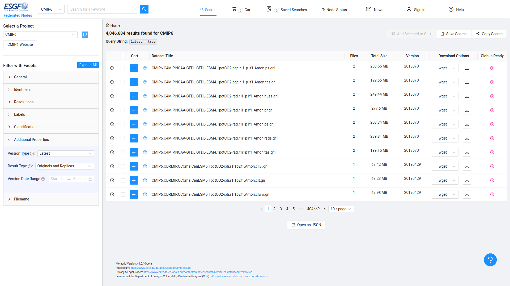

# Data Collection

After setting up the environment, we can start collecting required climate datesets. In this research we will use: (1) ERA5-Land reanalysis data, (2) SA-OBS observational data, and (3) CMIP6 EC-Earth3 climate projection data. Except for SA-OBS, all of the datasets are required to sign up for a free account on the respective website. The SA-OBS dataset is available for free without any registration. We will explain how to download each dataset below.

## SA-OBS Observational Data

SA-OBS or Southeast Asia Observational dataset is a dataset that contains daily climate data from 1981 to 2014, developed by the BMKG and KMNI. It is available for free on [SACAD website](https://sacad.bmkg.go.id/download/grid/download.php). They provide two resolutions: 0.25° and 0.5°. We will use the 0.25° resolution dataset, which is available in NetCDF format. To download the dataset, one can just click each of the links directly on the website. The dataset is divided into several variables:; (1) **rr** as daily accumulated precipitation, (2) **tg** as mean temperature, (3) **tn** as minimum temperature, and (4) **tx** as maximum temperature. The dataset is supposedly to cover the whole Southeast Asia region, but due to the incompleteness of the data, some regions are not covered for some variables at certain time periods. The precipitation has already had the unit of mm/day and the temperature has the unit of °C. Thus, we only need to change the variable names of the precipitation from `rr` to `pr` to match the other datasets. The SA-OBS dataset will be used as the reference dataset for bias-correcting the ERA5-Land reanalysis dataset and the EC-Earth3 dataset.

## ERA5-Land Reanalysis Data

ERA5-Land is managed by the ECMWF Climate Data Store (CDS) and is available for free on their climate data store [website](https://cds.climate.copernicus.eu/datasets/reanalysis-era5-land?tab=download). To download the dataset, one must first sign up for a free account on the CDS website. 

After signing up, one should set up the CDS API by following the instructions on the [CDS API documentation](https://cds.climate.copernicus.eu/api-how-to). There are two ways to download the dataset: (1) manually requesting the dataset through the CDS website, or (2) using the CDS API to download the dataset programmatically. The second method is more efficient, since each request can only download one month of data. Because we need to download the data from 1950 to 2024, it will take a long time to download the data manually. Thus, we will use the CDS API to download the dataset programmatically.

<center>*CDS page for signing up for a free account*</center>

Requesting the dataset programmatically requires us to use CDS API, which we can install using python's pip package manager. Open the terminal and type `pip install cdsapi` to install the CDS API package. After that, we need to create a file named `.cdsapirc` in our home directory. One should note that the directory is depend on their operating system. For example, on Windows, the home directory is `C:\Users\<username>`, while on Linux or MacOS, it is `/home/<username>` or `/Users/<username>`. The `.cdsapirc` file should contain the following lines:

```
url: https://cds.climate.copernicus.eu/api
key: <PERSONAL-ACCESS-TOKEN>
```
Replace `<PERSONAL-ACCESS-TOKEN>` with the personal access token that you can find on your [CDS account page](https://cds.climate.copernicus.eu/api-how-to). Be sure that you are already logged on to your account, so that the page will show your API token. After that, we can use the CDS API to download the dataset.

<center>*CDS API personal access token page*</center>

Through the CDS, we can download the dataset with our desired region, time period, and variables. The ERA5-Land dataset has a resolution of 0.1° and covers the whole globe. Since the only daily datasets are for the three temperature variables, we decided to download the hourly datasets for both precipitation and temperature variables. The variables that we will download are: (1) **2m_temperature** as the mean temperature, and (2) **total_precipitation** as the precipitation. The time period that we will download is from 1950 to 2024, and the region is Southeast Asia with a bounding box of `[10, 90, -15, 145]` (north, west, south, east). The downloaded dataset filename will look like randomly generated, thus we will rename it to `era5-land_<variable>_<year>.nc` for easier identification. The following code is an example of how to download the dataset using the CDS API:

```python
# Downloads ERA5-Land data in parallel using cdsapi

import os
import cdsapi
import concurrent.futures
from random import randint
from time import sleep

def download_era5_data(cds, dataset, var, short, year, month, days, times, area, out_dir):
    path = os.path.join(out_dir, short, f"{short}_{year}_{month}.nc")
    os.makedirs(os.path.dirname(path), exist_ok=True)
    if os.path.isfile(path):
        print(f"File {path} exists. Skipping.")
        return
    params = {
        "variable": [var], "year": year, "month": month, "day": days, "time": times,
        "format": "netcdf", "area": area, "download_format": "unarchived"
    }
    for attempt in range(3):
        try:
            cds.retrieve(dataset, params, path)
            print(f"Downloaded: {path}")
            return
        except Exception as e:
            wait = randint(30, 180) * (attempt + 1)
            print(f"Error: {e}. Retrying in {wait}s...")
            sleep(wait)
    print(f"Failed: {path}")

if __name__ == "__main__":
    VNAME = {'2m_temperature': 'tas', 'total_precipitation': 'pr'}
    MONTHS = [f"{m:02d}" for m in range(1, 13)]
    DAYS = [f"{d:02d}" for d in range(1, 32)]
    TIMES = [f"{h:02d}:00" for h in range(24)]
    AREA = [10, 90, -15, 145]
    DATASET = "reanalysis-era5-land"
    OUTDIR = "."
    YS, YE = 1966, 1966

    cds = cdsapi.Client()
    tasks = [
        (cds, DATASET, v, s, f"{y:04d}", m, DAYS, TIMES, AREA, OUTDIR)
        for v, s in VNAME.items()
        for y in range(YS, YE + 1)
        for m in MONTHS
    ]
    with concurrent.futures.ThreadPoolExecutor(max_workers=12) as ex:
        ex.map(lambda args: download_era5_data(*args), tasks)

```

You can find the full download script on the [Scripts directory](../Scripts/000-1-era5land-download.py). On the first lines, you can adjust what period of year you wanted to download. Below that is the region clipper. `VNAME` is the array of our variables: temperature and precipitation. Since we needed hourly data from 1950 to 2024, we need to specify the hours, which are full 24 hours or an hourly timestep. The script will try to iterate from variable > year > month. The script will also request 12 data in parallel, to speed up the request. This python script is not limited to ERA5-Land hourly single pressure dataset, one can modify this to request for another dataset, ERA5 hourly pressure levels for example. Be patient throughout the process, since it will take a long time to request all of the data. One request of data will take roughly around 45 minutes to 1 hour, depending on the server load. The script will automatically check if the file already exists, so it will not download the same file again. But be sure to check unfinished downloads if you were to restart the script, since it will not resume the download if the file already exists. 

## EC-Earth3 CMIP6 Climate Projection Data

EC-Earth3 is a coupled climate model that is used in the CMIP6 project. The dataset is available for free on the [Earth System Grid Federation (ESGF) website](https://esgf-node.llnl.gov/projects/cmip6/). Officially, to download the dataset, one must first sign up for a free account on the [ESGF website](https://esgf.github.io/nodes.html). Make sure you choose the COG not the Metagrid, since we need the OpenID authentication to download the dataset. In this documentation, we will extract the download links generated from the ESGF, since downloading using `wget` takes too long and is not efficient. Fortunately, we do not have to sign up for an account to request the `wget` script, so feel free to skip the registration step. 

The search filter is on the west or left side of the page. For this research, we will search for the following filters: 
1. **Identifier** > **Source ID** > **'EC-Earth3'**
2. **Identifier** > **Experiment ID** > **'historical'**, **'ssp126'**, **'ssp245'**, **'ssp370'**, **'ssp585'**
3. **Labels** > **Variant Labbel** > **'r1i1p1f1'**
4. **Classification** > **Frequency** > **'day'**
5. **Classification** > **Variable ID** > **'pr'**, **'tas'**, **'tasmax'**, **'tasmin'**

You can also save the search filter by clicking the "Save Search" button on the top right corner of the page. Select all of the datasets that you want to download, and add to cart. Move on to the cart page, and select the datasets you want to download the script for. To tidy up the process, let's divide the datasets by its Experiment ID. Select up the datasets, change the download option to `wget` on the bottom page, and press download. The website will generate a script that you can download. 

<center>*ESGF search page*</center>

If you decided to download the dataset using `wget`, you can type `wget -H <script_name>.sh` on the terminal to download the script. It will ask you your OpenID username and password, which you can find on the ESGF account page. Before initiating the download, type `chmod +x <script_name>.sh` to make the script executable. After that, you can run the script by typing `bash <script_name>.sh`. The script will download the dataset to the current directory. 

In my experience, downloading the dataset using `wget` is not efficient, since it will take a long time to download the dataset. Thus, I decided to extract the download links from the script and download them using a bash script. The following is an example of how to extract the download links from the script:

```sh
#!/bin/bash

# Path to your script
SCRIPT_FILE="ec-earth3-hist.sh"

# Extract the content of the download_files variable
# This sed command finds the start and end markers of the heredoc
file_list_content=$(sed -n '/^download_files="$(cat <<EOF--dataset.file.url.chksum_type.chksum$/,/^EOF--dataset.file.url.chksum_type.chksum$/{
    /EOF--dataset.file.url.chksum_type.chksum$/d
    /^download_files/d
    p
}' "$SCRIPT_FILE")

# Process each line to extract the URL
echo "$file_list_content" | while IFS= read -r line; do
    # Skip empty lines or lines that are not data entries
    if [[ -z "$line" || "$line" =~ ^# ]]; then
        continue
    fi
    # Use awk to extract the URL (the 2nd field when splitting by single quote as delimiter,
    # which becomes the 4th field in awk if FS='\'')
    url=$(echo "$line" | awk -F"'" '{print $4}')
    echo "$url"
done > idm_url_list.txt

echo "URLs extracted to idm_url_list.txt"

```

Then you can import the txt file to any download manager, such as Internet Download Manager (IDM) or Aria2, to download the datasets. If you happen to use WSL, I recommend using IDM, since it was faster than using any package inside the WSL.

The workflow of downloading the EC-Earth3 dataset is applicable to any CMIP6 dataset, as long as you can find the dataset on the ESGF website. You can also use the same method to download other datasets, such as CMIP5 or CORDEX datasets, by adjusting the search filters accordingly.